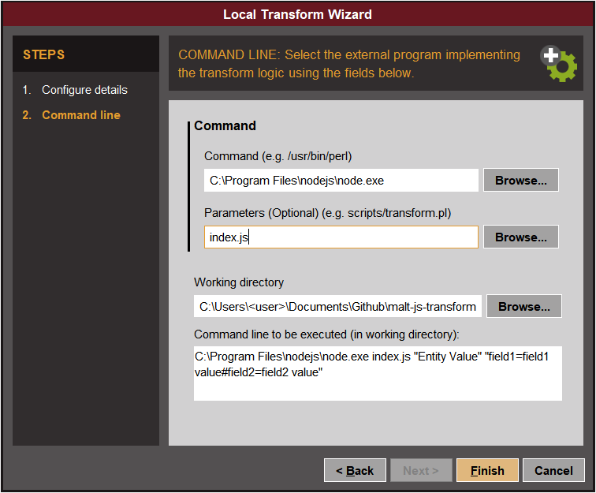

## Usage
### Local Transforms
In order to use these transforms locally do the following.

#### Install Node:
Install the latest LTS release of Node [from their website](https://nodejs.org/en/)

#### Download the project
Clone or download the project onto your machine using the Github `Clone or Download` button.

#### Install the project dependencies
Run the following command **from the project directory** to install the dependencies
```
npm install
```

### Add as a local transform to Maltego
Open the Maltego client and from the ribbon bar, select the `Transforms`
 tab and click the `New Local Transform` button.
 
A `Configure Details` window will appear. 

The most important parameter is the `Input Type`, as this cannot be changed later. 
The rest of the information only affects what is displayed in the client, and can be chosen by the end user.

Click `Next` to go to the `Command Line` config screen.

The settings required are the following:
- `Command` - The path to your Node interpreter executable. (E.g. `C:\Program Files\nodejs\node.exe`)
- `Parameters` - The name of the file that will be executed. In this case `index.js`
- `Working Directory` - Path to the folder containing the project. (E.g. `C:\Users\<user>\Documents\Github\malt-js-transforms`)

Click `Finish` to save your local transform.


